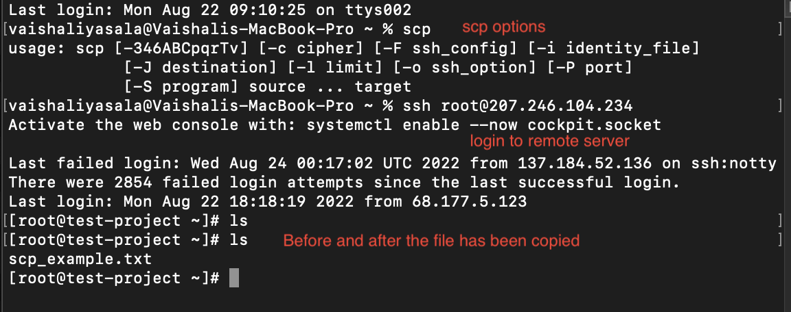
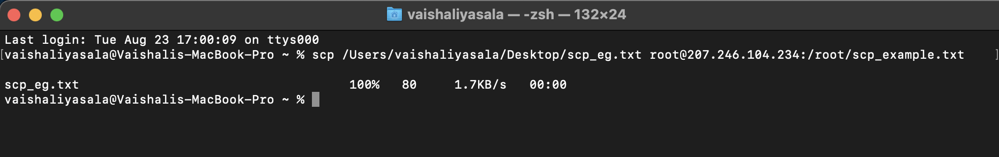

# bash-commands

## SSH 
Running the SSH command on its own returns a list of SSH command parameters and options. 

#### INPUT 
> Command : ssh
#### OUTPUT

### SSH userid 
In this case, user id and password provides a connection to a remote host using the input example command below.   The most basic way to invoke the program is to use ssh command along with the remote server host name or IP address. Then it asks for username and password.

#### INPUT
> Command: ssh UserName@IPAddress

#### OUTPUT
After connecting to remote server, testing to see the contents it. 

### SSH USING THE KEY FILE 
Using ssh key pair file to connect to the remote host from local host

#### INPUT
1. Initially checking for the key files in the local machine.  
> command: ls -ltr *.pem (Because the key pair here is a pem file)   
2. And then making the key publicly not viewable for the SSH to work.   
> Command: chmod 400 key_pair_file  
3. To connect with key_pair.   
> Command: ssh -i "key_pair_file" remote_host_userID@server.example.org (Specify the key with the -i option)

#### OUTPUT

### SSH password-less 
Initially, creating a key using ssh-keygen. Secondly, using ssh-copy-id to get copy public key of the key file for the first time and then connect password less after that.   

ssh-keygen is a program to create a new authentication key pair for SSH, which can be used to automate logins, to implement SSO and to authenticate hosts.   
> Command: ssh-keygen -t ed25519 -C "your_email@example.com"   

ssh-copy-id is a program used to copy, install and configure an SSH key on a server to automate passwordless logins and SSO.   
> Command: ssh-copy-id -i ~/.ssh/example_key.pub example_user@IPaddress (Specify the public key to be transferred with the -i option. Replace the example with your username and the server's IP address.)

 

## SCP
SCP (secure copy) is a command-line utility that allows you to securely copy files and directories between two locations.  
> Command: scp [OPTION] [user@]SRC_HOST:]file1 [user@]DEST_HOST:]file2  
1. OPTION - scp options such as cipher, ssh configuration, ssh port, limit, recursive copy …etc.  
2. [user@]SRC_HOST:]file1 - Source file.  
3. [user@]DEST_HOST:]file2 - Destination file.  

### Copying a File from a Local Computer to a Remote Server

#### INPUT
Copying a file from local host to a remote server and naming what the file should be called. Here, in this case, it is called scp_eg.txt on local computer and scp_example.txt on the remote server.    
> Command: scp /Users/vaishaliyasala/Desktop/scp_eg.txt root@207.246.104.234:/root/scp_example.txt 

#### OUTPUT
#### Image 1:
The first image is to show ssh passwordless login from the local computer to the remote server. And also, to show the file existence on the remote server with the ls command before and after the transfer.

#### Image 2:
 Second one is to show the result of input command given above.

### Copying a File from a Remote Server to a Local Computer
Connecting to the remote server and then creating a file "a-file.txt" with text "Hello World" in it. Then, copying this file from remote server to the local computer. 

#### INPUT 
> Command: scp root@207.246.104.234:/root/a-file.txt ~/Desktop/a-file.txt  

#### OUTPUT
#### Image 1:
This image shows the login to the remote machine, creating a file on there and checking if it worked.

#### Image 2:
This image shows the command to copy the file created earlier on the remote server to the local computer.

## CP
cp stands for copy. This command is used to copy files or group of files or directory. It creates an exact image of a file on a disk with different file name. cp command require at least two filenames in its arguments. 
> Options:  
1. -i - i stands for interactive copying.
2. -b - creates the **backup** of the destination file in the same folder with the different name and different format.
3. -f - f stands for force and it can be used when the user doesn't have writing permission for this file. Then by using -f option with cp command, destination file is deleted first and then copying of content is done from source to destination file.
4. -r - to copy an entire directory **recursively**. Example of this option is shown in image 3 below.
5. -p - To **preserve** the time of the last data modification and the time of the last access, the ownership (only if it has permissions to do this), and the file permission-bits of each source file in the corresponding destination file.
Note: Preservation of characteristics is only possible if you are the root user of the system, otherwise characteristics changes.

#### INPUT
> Command:  
cp [OPTION] Source Destination  
cp [OPTION] Source Directory  
cp [OPTION] Source-1 Source-2 Source-3 Source-n Directory  

First and second syntax is used to copy Source file to Destination file or Directory. Third syntax is used to copy multiple Sources(files) to Directory.

#### OUTPUT
#### Image 1:
The image below shows copying a file in the same folder with a slightly different name.

#### Image 2:
The image below shows copying a file to a directory with the same name.

#### Image 3: 
The image below shows copying a directory from one to another. 

## MV
mv stands for move. It can be used to move one or more files from one place to another in a file system like UNIX.  
> Options: -i, -f, -b options are same as for cp command. 
1. -n - with **no-clobber** option, mv prevents existing files to be overwritten.
2. -v - this shows the **version** of mv running on the system.

#### INPUT

> Command: mv [OPTION] source destination

#### OUTPUT
The image below shows moving "a-file-copy.txt" file Desktop directory to Commands_files directory.

## GREP and How to Make Pipe Commands
grep stands for global regular expression print. It searches a file for a particular pattern of characters and prints them.  
Options:
1. -c : This prints only a count of the lines that match a pattern
2. -h : Display the matched lines, but do not display the filenames.
3. -i : Ignores, case for matching
4. -l : Displays list of a filenames only.
5. -n : Display the matched lines and their line numbers.
6. -v : This prints out all the lines that do not matches the pattern
7. -e exp : Specifies expression with this option. Can use multiple times.
8. -f file : Takes patterns from file, one per line.
9. -E : Treats pattern as an extended regular expression (ERE)
10. -w : Match whole word
11. -o : Print only the matched parts of a matching line,
 with each such part on a separate output line.
12. -A n : Prints searched line and nlines after the result.
13. -B n : Prints searched line and n line before the result.
14. -C n : Prints searched line and n lines after before the result.

> Command: grep [OPTIONS] pattern [FILES]

#### INPUT
In the image below, searching for a row in a csv file located in Downloads, with reference to a specific word. 

#### OUTPUT

Some of the other options I used on a .txt file with Unix written in various forms. Some of these options can be combined and they are shown in the command line of the image below:

## MKDIR

Making a directory with using mkdir in the command line. This can be used to make a single directory or multiple directories. It can also be used to make a sub-directory in a directory and the same is shown in the image below.

## check which process are running
ps - ps command stands for process status. It gives out a list of running processes. man ps command gives the list of options and how to use them.
#### INPUT 
> ps 
 

You can also use the _**top**_ task manager command in Linux to see a real-time sorted list of top processes that use the most memory or CPU.
#### OUTPUT
The otput below displays all the processes that are running on this machine. The columns represent the following:  
PID returns the unique process ID.   TTY  returns the terminal type it is logged on.   TIME returns the total amount of CPU usage.   CMD returns the name of the command that launched the process.

When listing processes, it could be a long list. We can make use of pipe to display a specific process (eg: Safari) that matches a particular name as shown below:

## Output Redirection
Initiallt, redirecting the output result of a command from the terminal to a specific file.

#### INPUT
> Command: ls -l  
This command returns the list of files inside a directory.

> Command: ls -l > file.txt  
This command creates the file "file.txt" and redirects the output of ls -l command into it.

> Command: ls -l >> file.txt  
Running this command multiple times adds more output resulting in a larger file. 

> Command: ls -l | grep file  
By using pipe here, the output of ls -l command is redirected to the next command grep file.

#### OUTPUT
Image 1:

Image 2: 

Image 3:

Image 4:

## Running a process in the background
Running a process in the terminal can sometimes occupy it, hindering it from running any other executable command. In such cases, running a process in the background can free up the terminal to run other processes.

#### INPUT
Inserting an ampersand '&' at the end of syntax before exexcuting it makes the process run in the background. The example command below running by itself would make the terminal unavailable for 100 seconds but with an ampersand, it runs in the background.
> Command: sleep 100 &

This can also be achieved with _**bg**_ command. 

#### OUTPUT
Image 1:  
The image below explains the use of & and bg commands to help run processes in the background.

Image 2:  
This image is the screenshot of a different terminal to view if any processes are running on http server. It shows the before and after result of the process that has been executed. 

### Background running process even after session ended
### 1. Using nohup
nohup is known to invoke a utility immune to hangups. It is used to keep a process running in the background even if the terminal in which the command is executed accidentally shuts off.  

In the image below, you can see an example of nohup command.

The image below shows if nohup is working. It is the screenshot of ps command from a different terminal. 

### 2. Using disown
**disown** command removes all the jobs running in the current terminal. But they can be seen running in the background on a different terminal with ps command.
#### INPUT
> Command: disown %n  
where n is the job number

Below image of a second terminal where it shows the  processes are running in the background. It is executed after they don't show up as running with jobs command in their current terminal.

## Running a process in the background with output redirection
In Output Redirection section above, we used the symbol '>' in syntax before the path of destination file. The same is used for running a process in the background to redirect the output to a destination file. 

#### INPUT
nohup helps in running the process even if the terminal shuts off and '&' at the end to make it run in the background.

> Command: nohup python3 -m http.server 8080 > 
/Users/vaishaliyasala/Commands_files/html_template/some_file.txt &

#### OUTPUT

## Check process running on a port
In the section above, we were a process on port 8080. Let's check if port 8080 is in use with lsof command given below.
#### INPUT
> Command: lsof -i :port_number

#### OUTPUT

## Firewall 
Firewall provides an added layer of protection against cyber attacks by shielding the computer or network from malicious or unnecessary network traffic. Firewalls can also prevent malicious software from accessing a computer or network via the internet.

### Add a port 
In this case, checking if the firewall is turned for the computer. Once it is turned on, we can add additional settings making it accessible only to certain ports. This can be seen in the following steps: 

1. The command below is used to stop the pf (packet filter) firewall if it's active:
> sudo pfctl -d 

Packet filtering is a firewall technique used to control network access by monitoring outgoing and incoming packets and allowing them to pass or halt based on the source and destination Internet Protocol (IP) addresses, protocols and ports.

2. Next, use the nano text editor to open the configuration file for pf:

>sudo nano /etc/pf.conf

3. The editor will show the contents of the default config, which contains some important stuff. Here, we can add custom rules, but it has to be below the existing configurations.

To break down the rule written in the default config file above, it is allowing (__pass__) incoming (__in__) TCP (__inet proto tcp__) traffic from any machine to any other machine (__in this context, just this machine__) on port 12044 with no state inspection.

4. To re-load the firewall's configuration from the file edited before (rule added): 

>sudo pfctl -f /etc/pf.conf

5. To re-start the firewall:

> sudo pfctl -E

With this, port 12044 is opened through the firewall security. 

### Remove a port

## Show hidden files
On Mac, there are certain files that are important and not to be made changes to. Such files are hidden and to view those files, we can either use finder or through terminal. 

#### INPUT
> defaults write com.apple.Finder AppleShowAllFiles true

The command above makes the hidden files visible.
> killall Finder

This command refreshes the finder application and the hidden files are directly viewable if the finder is already open as shown in Image 2 in output below. Else, open the finder after the executing the command and the hidden files become visible. 

To hide the hidden files again, just use the following command.
> defaults write com.apple.Finder AppleShowAllFiles false

Refresh it again as shown in the image below. The folder looks like image 1 shown in output below.

#### OUTPUT
**Image 1** : Look at the user folder how it appears normally.

**Image 2** : The image below shows all the hidden files.

## LS Command
ls command lists all the contents in a directory. 

**OPTIONS** :

1. -l - lists the information of the files with columns indicating file mode, number of links, owner name, group name, number of bytes in the file, date, time and the path name. 
2. -d - Directories are listed as plain files (not listed Recursively).
3. -r - Reverse the order of the sort.

#### INPUT
Some of the command lines that are used:

> ls   
> ls -l  
> ls [options] [directory]

#### OUTPUT

### Additional Options: 
1. ls / command to list the contents of the root directory.
2. ls .. command to list the contents of the parent directory one level above. Use ls ../.. for contents two levels above.
3. ls ~ command to list the contents in the users's home directory.
4. ls -d */ command to list only directories.

In the terminal, executing *man ls* gives information about ls command and its various options and how to use them accordingly. 

## VI Command for Editing

VI command is used to open an interactive text editor that can be used to create and modify text files. The vi editor can be helpful in some cases where to edit a certain files without changing the permission of the files. The Vim editor is an improved version of the vi editor and it has replaced the vi editor on the current computer. 

#### INPUT
Usually vi editor is started to edit a single file with the command below if the file is in the current directory. 
> vi file  

If the file is in another directory, give the full pathname in the command as shown below to begin editing:
> vi /usr/johndoe/testfolder  

**Commands to Edit a File:**
1. i - To insert text and make changes to a file in the vi editor.
2. esc - To return to Command mode. 
3. :w - This will let you save the changes made to a file in the vi editor.
4. :wq - To save the changes made and quit the vi editor.
5. :q! - To quit vi editor without saving any changes made to a file. This is useful if any accidental changes have been made. 
6. :e! - To wipe out all the changes made to a file and return to the last saved version of the file. 
7. :w! - To the overwrite the current existing file.

**Movement Inside the File:**
1. h - left, one space
2. j - down, one line 
3. k - up, one line
4. l - right, one space  

Eg: Typing 10l moves the cursor to ten spaces to the right and the same applies for the letter commands given above.

5. 0 - Move to beginning of line.
6. $ - Move to end of the line.
7. w - To move forward one word at a time. 
8. b - To move backward one word at a time. 

#### OUTPUT

When the file is initially opened in the vi editor. To edit the file, i (insert) is used.

The image below is after using the commands given above to edit the file by making changes and saving it. 

## Navigating absolute and relative paths

An absolute path is defined as specifying the location of a file or directory from the root directory(/). In other words,we can say that an absolute path is a complete path from start of actual file system from / directory.

#### INPUT
To read a file from one of the directories of the current directory, we cannot dirrectly access it by writing the filename in the command line. Instead, it needs to be read by mentioning its full path in the command line. 

Here, the path of the file we are trying to read path is /Users/vaishaliyasala/Commands_files/a-file-copy.txt. That means it is addressed from the root directory.

> cat /Users/vaishaliyasala/Commands_files/a-file-copy.txt

#### OUTPUT 
The file a-file-copy.txt has Hello World written inside it and let us look at it from the terminal with read command given above. 
Image 1:

Relative path is defined as the path related to the present working directly(pwd). It starts at your current directory and never starts with a / .

#### INPUT
As shown in the image 2 below, pwd command gave us the current working directory. To read this text file from the current working directory, using relative path is the easy way to go. 

> cat Commands_files/a-file-copy.txt 

#### OUTPUT

## How is linux filesystem organized

## How to add to a path to the path variable

## EXPORT command

## Check how many user accounts are there on the machine. 

## How to switch between users 

## Create a new user 
## Check user home dir 
## Delete the new user 
## Adding groups to the user 
## Removing groups from the user 
Changing file permissions 
Changing dir permissions 
Make a file read only, read and write , read and write and execute 
How to make a file executable 
Make a folder read only, read and write , read and write and execute
Recursive commands with some examples 
Find command usage 
